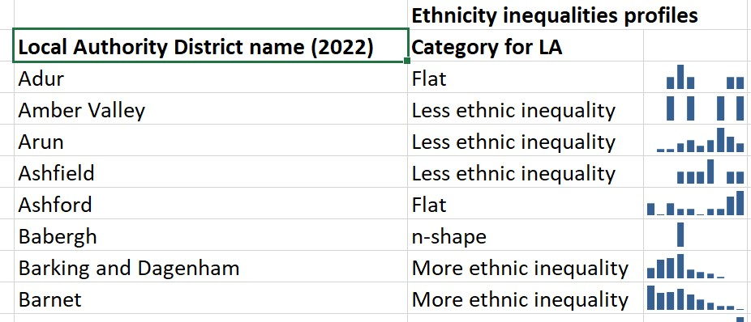

# The distribution of ethnic inequality in deprivation within Local Authorities
The analyses and data in this repo are based on the Ethnic Group Deprivation Index (Lloyd et al. 2023)
https://gedi.ac.uk/egdi/

And inspired by the approach the Office for National Statistics took for profiling Local Authorities based on the spread of income distribution
https://www.ons.gov.uk/visualisations/dvc1371/#/E09000030

The ONS very kindly shared their approach for building the profiles in this dataset:
https://www.ons.gov.uk/peoplepopulationandcommunity/personalandhouseholdfinances/incomeandwealth/datasets/mappingincomedeprivationatalocalauthoritylevel

## Local Authority profiles data
[`EGDI-Local-Authority-profiles.xlsx`](https://github.com/britishredcrosssociety/ethnicity-deprivation-index/raw/main/data/EGDI-Local-Authority-profiles.xlsx) is an Excel version of the Local Authority profiles, including sparklines showing the distribution of inequality within.

[`egdi-ltla22-profiles.csv`](https://github.com/britishredcrosssociety/ethnicity-deprivation-index/raw/main/data/egdi-ltla22-profiles.csv) provides a list of Local Authorities and their profiles in .csv format.

## Creating the profiles
The R script in [`R/create local authority profiles.R`](https://github.com/britishredcrosssociety/ethnicity-deprivation-index/blob/main/R/create%20local%20authority%20profiles.R) contains the code to replicate this analysis.
